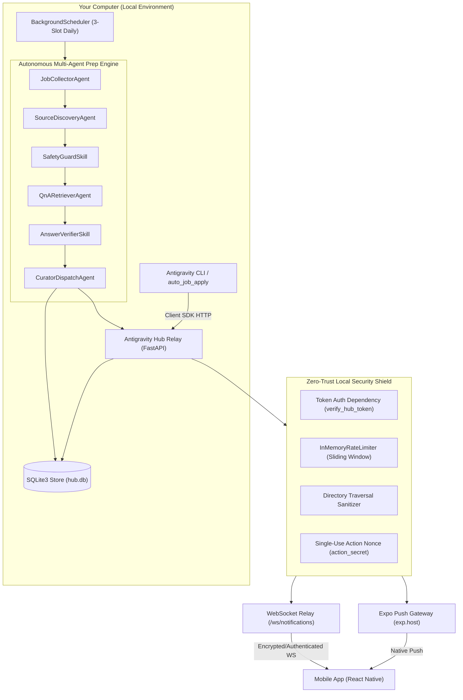
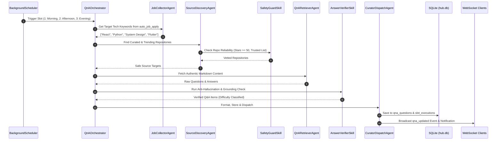
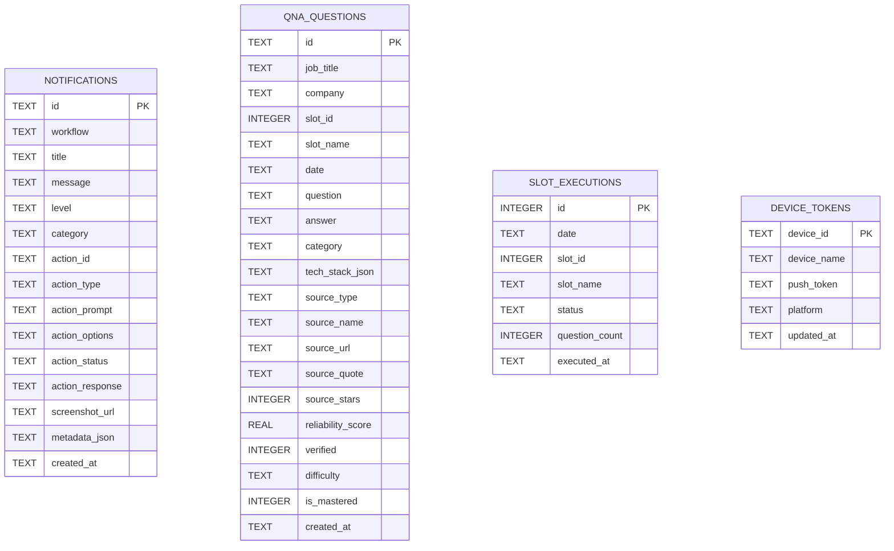

# Antigravity Hub • Backend Architecture & Security Blueprint

**Version:** 2.1.0  
**Stack:** FastAPI • Python 3.12 • SQLite3 • WebSockets • Expo Push API • Systemd Service  
**Repository Path:** [`backend/`](file:///home/saurabh/coding/antigravity_hub/backend)

---

## 🏛️ System Overview

Antigravity Hub serves as the **100% local, high-security relay, remote-control bridge, and autonomous multi-agent interview preparation engine** connecting:
1. **Google Antigravity CLI workflows**, autonomous coding agents, and pipeline automations (e.g., `auto_job_apply`).
2. **Personal Mobile Devices** running the Antigravity Hub React Native / Expo application over local Wi-Fi or secure mesh tunnels (Tailscale).



---

## 🔒 Security Architecture & Threat Model

Antigravity Hub implements a hardened **Zero-Trust Local Network** security model. Because the relay binds to local network interfaces (`0.0.0.0`) to communicate with mobile phones, multiple defensive layers are enforced:

### 1. Pre-Shared Token Authentication (`X-Hub-Token`)
- **Auto-Generated Cryptographic Secret**: On initialization, if no secret exists in `ANTIGRAVITY_HUB_TOKEN` or `HUB_API_KEY`, the server generates a 32-byte hex token (`secrets.token_hex(32)`) saved to [`backend/data/.hub_secret`](file:///home/saurabh/coding/antigravity_hub/backend/data/.hub_secret).
- **Filesystem Permissions**: The `.hub_secret` file is locked to mode `0600` (`-rw-------`), preventing other local OS users from reading the credential.
- **Timing-Attack Immune Verification**: The authentication dependency [`verify_hub_token`](file:///home/saurabh/coding/antigravity_hub/backend/api/deps.py) uses `secrets.compare_digest()` to evaluate credentials.
- **Multi-Transport Token Ingestion**:
  1. Header: `X-Hub-Token: <token>`
  2. Header: `Authorization: Bearer <token>`
  3. Query Parameter: `?token=<token>` (Used for WebSocket handshake and image streaming)
- **Public Whitelist**: Only non-sensitive endpoints remain public (`/`, `/api/status`, `/download`, `/apk`, `/docs`). All administrative, notification, question, and action routes require token authentication.

### 2. Remote Action & 2FA/OTP Nonce Security
When automation workflows request human intervention (e.g. entering SMS OTPs, CAPTCHAs, or approving actions):
- **Cryptographic Action Nonce**: When `/api/request-action` is called, the backend issues an ephemeral `action_secret = secrets.token_urlsafe(16)`.
- **Payload Isolation**: The `action_secret` is delivered **only** to the authenticated mobile device via push/WebSocket.
- **Verification on Resolution**: The `/api/actions/{action_id}/respond` route requires **both** the global `X-Hub-Token` AND the matching `action_secret`.
- **Single-Use Destruction**: The moment an action completes or times out, its future and secret are immediately scrubbed from memory.

### 3. Protected Screenshot Delivery & Path Traversal Guards
- Workflow screenshots (e.g., job portal verification screens) are stored in [`backend/data/screenshots/`](file:///home/saurabh/coding/antigravity_hub/backend/data/screenshots).
- **No Open Static Mount**: The open static mount was replaced by authenticated routes: `GET /api/screenshots/{filename}` and `GET /screenshots/{filename}`.
- **Path Traversal Sanitization**: [`sanitize_filename()`](file:///home/saurabh/coding/antigravity_hub/backend/api/deps.py) checks that:
  - The filename matches regex `^[a-zA-Z0-9_\-\.]+$`.
  - No `..`, directory separators (`/`, `\`), or hidden prefixes exist.
- **Auto-Pruning Policy**: Screenshots older than 24 hours (`SCREENSHOT_MAX_AGE_HOURS`) are automatically purged on startup and periodic maintenance.

### 4. Restricted CORS Policy
- Prevents malicious browser tabs from firing background AJAX requests to `http://localhost:8765` or your LAN IP.
- Allowed origins are restricted strictly to local bundlers (`http://localhost:8081`, `http://localhost:19006`, `http://localhost:8765`, `http://127.0.0.1:8765`).

### 5. Rate Limiting & Anti-Brute-Force
- Implemented via [`InMemoryRateLimiter`](file:///home/saurabh/coding/antigravity_hub/backend/api/deps.py) with sliding time windows:
  - **Action Resolution**: Maximum 10 requests / 60 seconds per IP.
  - **QnA Pipeline Manual Trigger**: Maximum 5 requests / 60 seconds per IP.
  - **Failed Authentication Lockout**: 15 failed token attempts in 5 minutes triggers an IP-level lockout.

---

## 🤖 Multi-Agent Interview Prep Pipeline



### Agent Roles:
1. [`JobCollectorAgent`](file:///home/saurabh/coding/antigravity_hub/backend/agents/job_collector.py): Connects to `auto_job_apply/data/job_applications.db` and extracts active skills.
2. [`SourceDiscoveryAgent`](file:///home/saurabh/coding/antigravity_hub/backend/agents/source_discovery.py): Scans curated repos (`yangshun/tech-interview-handbook`, `donnemartin/system-design-primer`, etc.) and LeetCode/Engineering Blogs.
3. [`SafetyGuardSkill`](file:///home/saurabh/coding/antigravity_hub/backend/agents/skills/safety_guard.py): Whitelists safe domains, enforces file size limits, and blocks all executable extensions (`.sh`, `.exe`, `.bin`, `.py`).
4. [`AnswerVerifierSkill`](file:///home/saurabh/coding/antigravity_hub/backend/agents/skills/answer_verifier.py): Rejects hallucinated, incomplete, or ungrounded Q&A items. Requires verifiable citation and source quote.
5. [`CuratorDispatchAgent`](file:///home/saurabh/coding/antigravity_hub/backend/agents/curator_dispatch.py): Formats questions with difficulty and category, saves to database, and triggers push notifications.

---

## ⏰ Intelligent 3-Times-A-Day Schedule & Skip Logic

Defined in [`core/time_slots.py`](file:///home/saurabh/coding/antigravity_hub/backend/core/time_slots.py) and managed by [`core/scheduler.py`](file:///home/saurabh/coding/antigravity_hub/backend/core/scheduler.py):

| Slot | Period | Theme | Hours |
| :--- | :--- | :--- | :--- |
| **Slot 1** | Morning | Core Fundamentals & Language Internals | `04:00 – 11:00` |
| **Slot 2** | Afternoon | Architecture, Coding Patterns & System Design | `11:00 – 17:00` |
| **Slot 3** | Evening | Real-World Scenarios, Company Specifics & Behavioral | `17:00 – 24:00` |
| **Quiet** | Night | Silent Period (No automated pushes) | `00:00 – 04:00` |

### Skip Guarantee:
If the user turns on their PC late in the day (e.g. at 7:00 PM), earlier slots (Slot 1 and Slot 2) are automatically marked as `skipped` in `slot_executions`. The user only receives the current slot (Slot 3) without receiving bulk notification dumps.

---

## 🗄️ Database Architecture ([`database/schema.py`](file:///home/saurabh/coding/antigravity_hub/backend/database/schema.py))



---

## 🔌 Universal Client SDK (`client_sdk/`)

Any Python script, agent, or automation workflow can integrate with 2 lines:

```python
from client_sdk.antigravity_notify import notify

# 1. Dispatch Instant Alert
notify.send(
    title="Workflow Completed",
    message="Applied to 14 jobs successfully.",
    level="success",
    category="job_applied"
)

# 2. Synchronous Human-in-the-Loop Action (blocks until phone answers)
otp_code = notify.request_action(
    title="2FA Code Needed",
    prompt="Enter the 6-digit OTP sent to your phone",
    action_type="input",
    timeout_seconds=90
)
```

**Zero-Configuration Discovery**: The SDK automatically detects the active port from `backend/data/active_port.txt` and automatically authenticates using `backend/data/.hub_secret`.
