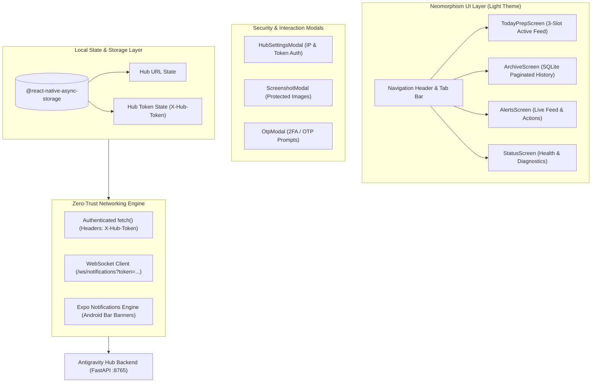
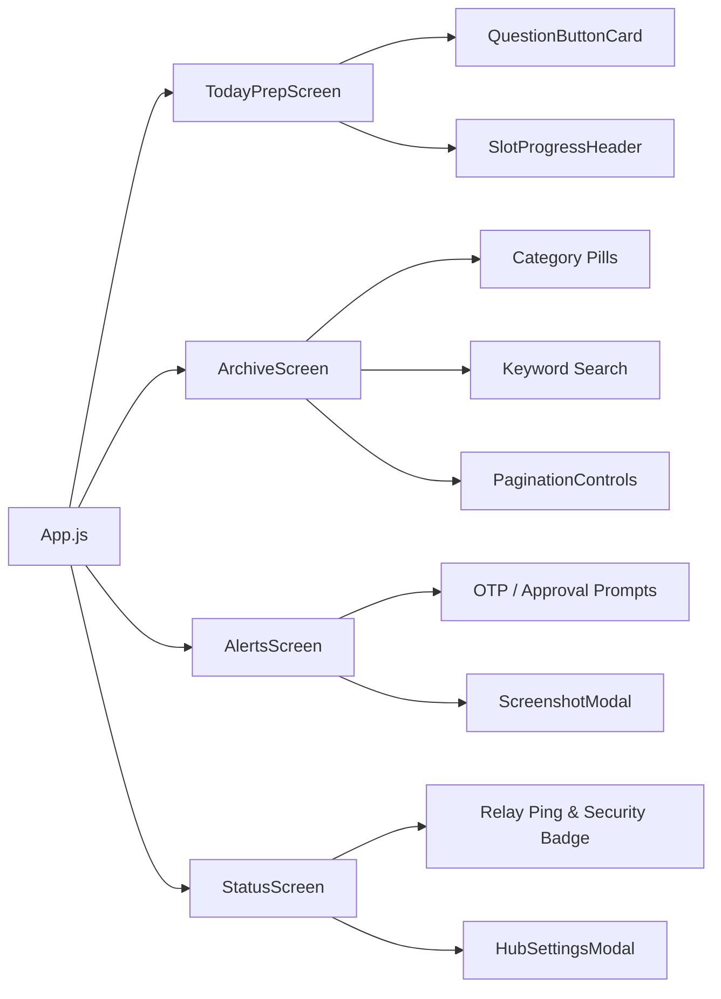

# Antigravity Hub • Mobile Client Architecture & Design System

**Version:** 2.1.0  
**Framework:** React Native 0.86.3 • React 19.2.3 • Expo SDK 57 • AsyncStorage • Expo Notifications  
**Repository Path:** [`mobile/`](file:///home/saurabh/coding/antigravity_hub/mobile)

---

## 📱 Mobile Architecture Overview

The **Antigravity Hub Mobile App** is a tactile, high-performance cross-platform application designed for daily interview preparation, system observability, and zero-latency human-in-the-loop remote control.



---

## 🎨 Neomorphism Design System Tokens ([`neomorphism.js`](file:///home/saurabh/coding/antigravity_hub/mobile/src/theme/neomorphism.js))

The user interface follows a modern, dual-tone **Neomorphism Light Theme** optimized for focus and tactile satisfaction.

### 1. Color Palette
| Token | Value | Role |
| :--- | :--- | :--- |
| `background` | `#e6eef8` | Soft blue-gray ambient canvas |
| `cardBg` | `#ebf1f8` | Raised surface tone |
| `primary` | `#2563eb` | Vibrant brand accent |
| `primaryDark` | `#1d4ed8` | Pressed / active state |
| `textPrimary` | `#0f172a` | High-contrast slate header typography |
| `textSecondary`| `#475569` | Body & meta text |
| `shadowLight` | `#ffffff` | Top-left specular bevel reflection |
| `shadowDark` | `#b8c9dc` | Bottom-right ambient occlusion shadow |

### 2. Neomorphic Component Library
- [`NeoCard`](file:///home/saurabh/coding/antigravity_hub/mobile/src/components/NeoCard.js): Elevated card wrapper featuring soft top-left white bevel and bottom-right blue-gray ambient drop shadow.
- [`NeoButton`](file:///home/saurabh/coding/antigravity_hub/mobile/src/components/NeoButton.js): Tactile action button with dynamic active press compression.
- [`NeoPill`](file:///home/saurabh/coding/antigravity_hub/mobile/src/components/NeoPill.js): Category and tech-stack badge indicator with subtle border relief.
- [`QuestionButtonCard`](file:///home/saurabh/coding/antigravity_hub/mobile/src/components/QuestionButtonCard.js): Primary learning card rendering questions as tactile buttons; tapping unfolds verified answers, authentic source links, difficulty badges, and review toggles.

---

## 🔐 Security & Network Architecture

### 1. Token-Based Authentication (`X-Hub-Token`)
- **Credential Storage**: The pre-shared hub token is saved locally in encrypted app storage via `@react-native-async-storage/async-storage` under the key `antigravity_hub_token`.
- **Request Ingestion**: Every API request (`TodayPrepScreen`, `ArchiveScreen`, `StatusScreen`, `AlertsScreen`) automatically attaches:
  ```javascript
  headers: {
    'Content-Type': 'application/json',
    'X-Hub-Token': hubToken,
    'Authorization': `Bearer ${hubToken}`
  }
  ```
- **Connection Diagnostics**: The [`HubSettingsModal`](file:///home/saurabh/coding/antigravity_hub/mobile/src/components/HubSettingsModal.js) includes a **"🔍 Test Auth"** tool that executes an authenticated probe to `/api/auth/verify`, giving instant feedback (`✅ Verified!`, `❌ 401 Unauthorized`, or `❌ Unreachable`).

### 2. Authenticated Real-Time WebSocket Streaming
- Connection URL: `ws://<ip>:<port>/ws/notifications?token=<encoded_token>`
- **Live Re-keying**: If the user updates their token in settings, the WebSocket automatically teardowns the existing socket and reconnects with the new token.
- **Resilient Auto-Reconnection**: Reconnects automatically on network drops (exponential backoff 3.5s – 4.0s) and syncs immediately when the app returns from background to active via `AppState`.

### 3. Ephemeral Action Nonces & Verification
- When an OTP prompt or human approval is triggered, the notification includes a cryptographically secure `action_secret`.
- When the user types the OTP or presses "Approve", the payload submits:
  ```json
  {
    "action_id": "act_12345",
    "response_value": "592014",
    "action_secret": "v8k9La..."
  }
  ```
  preventing replay or unauthorized resolution by third parties.

### 4. Protected Screenshot Streaming
- Screenshots sent from automation pipelines are served through the authenticated backend route.
- The mobile app appends the active session token:
  `${screenshotUrl}?token=${hubToken}`
  enabling `<Image source={{ uri: finalUrl }} />` to render the protected asset while denying public access.

---

## 📑 Screen Breakdown & User Flows



### 1. Today's Prep (`TodayPrepScreen`)
- **Daily Refresh Policy**: Questions are scoped to `today` (`YYYY-MM-DD`). Yesterday's questions automatically move to the permanent Archive, ensuring the daily view is clean, focused, and free of overwhelm.
- **Slot Progress Header**: Tracks completion for the 3 daily slots:
  - 🌅 Morning Fundamentals
  - ☀️ Afternoon Architecture
  - 🌙 Evening Scenarios
- **Mastered Toggles**: Mark questions as mastered or flag them for review.

### 2. Archive & History (`ArchiveScreen`)
- **Permanent SQLite Archive**: All questions from all past days are permanently preserved on the backend.
- **Search & Filter**: Real-time keyword search across questions and answers with category filters (`Fundamentals`, `Architecture`, `System Design`, `Real-World`, `Behavioral`).
- **Paginated Scrolling**: Efficient pagination controls with 8 items per page to prevent memory overhead.

### 3. Alerts & Remote Control (`AlertsScreen`)
- Displays real-time CLI activity feeds (e.g. applications submitted, test results).
- **Interactive Action Triggers**:
  - `input`: Pops up [`OtpModal`](file:///home/saurabh/coding/antigravity_hub/mobile/src/components/OtpModal.js) for SMS / 2FA OTP codes.
  - `confirm`: Approve / Reject buttons for autonomous actions.
  - `screenshot`: Opens fullscreen [`ScreenshotModal`](file:///home/saurabh/coding/antigravity_hub/mobile/src/components/ScreenshotModal.js) to inspect portal pages before approving.

### 4. Relay Status & Security Diagnostics (`StatusScreen`)
- Displays live backend connection status, server URL, and security state (`🔒 Authenticated (X-Hub-Token set)`).
- Quick manual slot triggers to run the multi-agent pipeline on-demand.
- Test alert dispatcher to verify end-to-end push notification delivery.

---

## 🔔 Native Push & System Banner System

Configured via `expo-notifications`:
- **Android 13+ Runtime Permissions**: Automatically requests `POST_NOTIFICATIONS` permission on boot.
- **High-Priority Channel**: Configured with `importance: MAX`, custom vibration rhythm (`[0, 250, 250, 250]`), and bypass-DND flags.
- **Zero-Latency WebSocket Banners**: Incoming WebSocket payloads trigger native Android notification drawer banners so you receive alerts even when glancing away from the screen.
